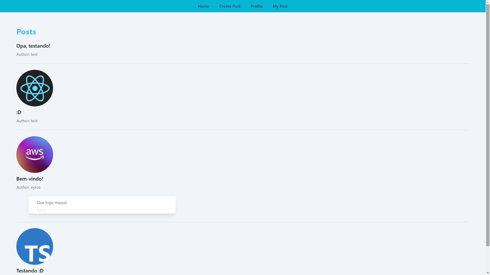
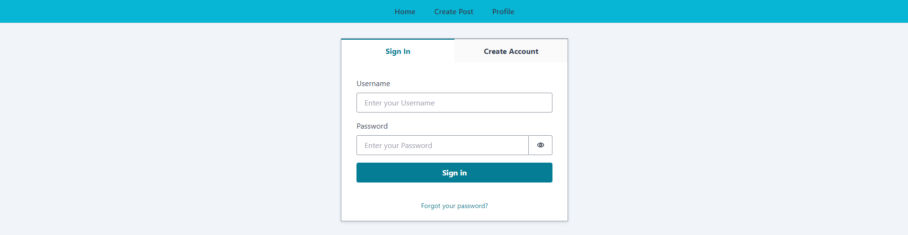
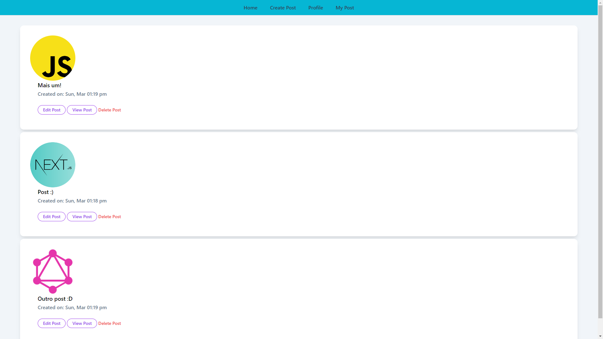

# Projeto de Blog utilizando Next.js + AWS.

# Navegando pela aplicação

## Tela inicial

## Tela de registro/login

## Tela das postagens do usuário

## Funcionalidades

<ul>
    <li>Cadastro de usuários com confirmação de código no e-mail.</li>
    <li>Criação, edição e remoção de postagens do usuário.</li>
    <li>Adição de comentários nas postagens.</li>
    <li>Upload de imagens no Amazon S3.</li>
    <li>Autenticação e autorização de rotas com Amazon Cognito.</li>
    <li>GraphQL Subscriptions + Amplify para eventos em tempo real.</li>
    <li>Página com as postagens do usuário para ele editar, remover, etc.</li>
</ul>

## Ferramentas

<ul>
<li>TypeScript</li>
<li>React</li>
<li>Next.js</li>
<Li>TailwindCSS</li>
<li>GraphQL</li>
<li>AWS Amplify</li>
</ul>
